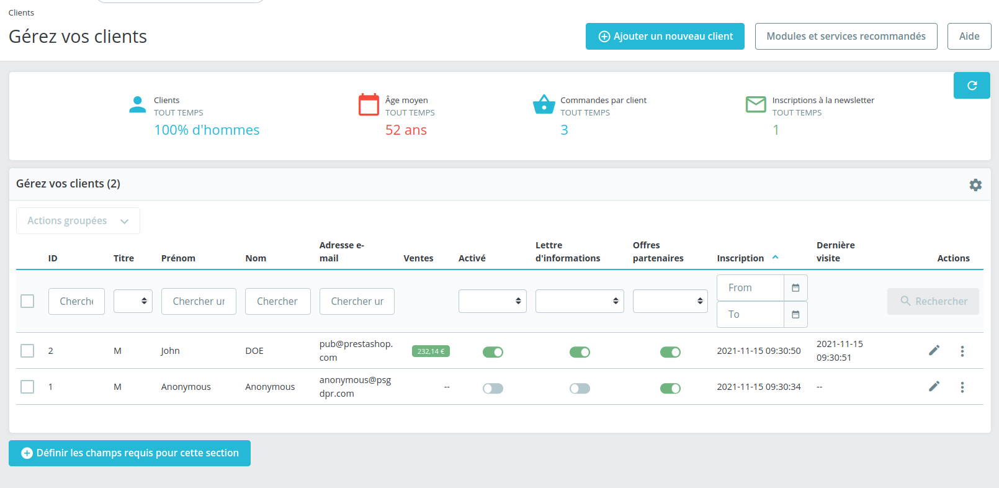

# Page Template

## Description

This section MUST describe the page shortly

It MUST include a QA part as below with the correct link.&#x20;

This section MUST include a screenshot of the Page

This section COULD include other screenshots of the page depending of the configuration (ex: B2B, Multistore ). Those screenshots MUST be labelled (ex : B2B ) for further uses ( see below)

The screenshot COULD include some labels or numbers to some UI component if needed. So you can refer to this "label" bellow.

### QA&#x20;

[Link to the test](https://build.prestashop-project.org/test-scenarios/)

## Components description

This section MUST describe each component one by one

### A component description

Several cases

1. The component is a common UI / UX (for example "Help button"): It MUST be a link to this [common components](../../ux-ui/common-components.md) (we recommend creating a dedicated change request when adding a new common component to the documentation)
2. The component is a common component with a standard behavior described in the [UI/KIT](https://build.prestashop.com/prestashop-ui-kit/?path=/story/modals--modal) or Design System : it must be a link to the UI/KIT or DS
3. Otherwise the component MUST be described as a Table as described bellow

<table><thead><tr><th>Description</th><th>Value</th><th align="center">Error message</th><th data-hidden></th></tr></thead><tbody><tr><td>Mandatory</td><td>YES/NO</td><td align="center">The Zip/Postal code is invalid. It must be typed as follows: </td><td>Error message if not allowed</td></tr><tr><td>Allowed/Forbidden values</td><td></td><td align="center"></td><td></td></tr><tr><td>Default value</td><td>Default value</td><td align="center">-</td><td></td></tr><tr><td>Help text</td><td>Help text</td><td align="center">-</td><td></td></tr><tr><td>Tool tips</td><td>Tool tips text</td><td align="center">-</td><td></td></tr><tr><td>Lower limit</td><td></td><td align="center"></td><td>Error message if bellow the limit</td></tr><tr><td>Upper limit</td><td></td><td align="center"></td><td>Error message if up to the limit</td></tr><tr><td>Behavior</td><td><a href="page-template.md#behaviors-description">link to the behavior</a></td><td align="center">-</td><td></td></tr></tbody></table>

This section COULD contains label (ex: multishop  ...)

## Behaviors description

This section MUST contains :

* A section with the whole picture of the behaviors and worfkow
* For each behavior, a sub section that describes it

### Workflow

This sub-section MUST describe the page workflow

This sub-section MUST include a diagram of this worflow (using : [https://app.diagrams.net/](https://app.diagrams.net) or [figma](https://www.figma.com/file/14ptOoCqDdmBqtmq1Grc5M/BO-Core-Cartography?node-id=0%3A1) ) & the xml export of this workflow

### Behavior description

* This sub-section MUST contains the description of the behavior / call to action.
* This sub-section COULD contains a link to the relevant [business rule](business-rules-template.md)

This section COULD contains label (ex: multishop case ...)

## Error messages

This section COULD list all errors messages / Exceptions for the page / workflow

## Limitations

This section SHOULD list limitations of the page.
