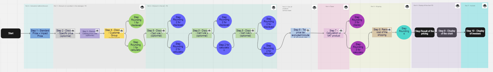

# Add/edit employee

## Description

This is page to create new employee or edit employee data.

<figure><figcaption>
Add new / edit employee User Interface
</figcaption></figure>

## Common components 

* [E-commerce logo](../../common-components/back-office-header/prestashop-logo.md).
* [PrestaShop version number](../../common-components/prestashop-version-number.md).
* [Quick access dropdown](../../common-components/quick-access-dropdown.md).
* [Search input](../../common-components/search-input-field.md) - [Forms input with dropdown UI kit](https://build.prestashop-project.org/prestashop-ui-kit/?path=/story/forms--input-with-dropdown).
* Bell icon (todo link)
* [Account icon](../../common-components/account-icon.md).
* [Breadcrumbs navigation](../../common-components/breadcrumbs.md) - [Breadcrumb UI kit](https://build.prestashop.com/prestashop-ui-kit/?path=/story/breadcrumb--breadcrumb).
* [Heading of the page](../../common-components/heading-of-the-page.md) - [Headings UI ](https://build.prestashop.com/prestashop-ui-kit/?path=/story/headings--headings)[kit](https://build.prestashop-project.org/prestashop-ui-kit/?path=/story/headings--headings).
* [Help button](../../common-components/help-button.md) - [Buttons outline UI kit](https://build.prestashop-project.org/prestashop-ui-kit/?path=/story/buttons--outline).
* Shop association block (todo link)
* [Cancel button](../../common-components/cancel-button.md) -  [Buttons outline UI kit](https://build.prestashop-project.org/prestashop-ui-kit/?path=/story/buttons--outline).
* [Save button](../../common-components/save-button.md) - [Buttons basics UI kit](https://build.prestashop-project.org/prestashop-ui-kit/?path=/story/buttons--basics).

## The UI elements

### First name input

<table><thead><tr><th>Description</th><th>Value</th><th align="center">Error message</th><th data-hidden></th></tr></thead><tbody><tr><td>Mandatory</td><td>Yes</td><td align="center">Please fill out this field.</td><td>Error message if not allowed</td></tr><tr><td>Allowed/Forbidden values</td><td>-</td><td align="center">-</td><td></td></tr><tr><td>Default value</td><td>-</td><td align="center">-</td><td></td></tr><tr><td>Help text</td><td>-</td><td align="center">-</td><td></td></tr><tr><td>Tool tips</td><td>Please fill out this field.</td><td align="center">-</td><td></td></tr><tr><td>Lower limit</td><td>1</td><td align="center">-</td><td>Error message if bellow the limit</td></tr><tr><td>Upper limit</td><td>-</td><td align="center"></td><td>Error message if up to the limit</td></tr><tr><td>Behavior</td><td>link to the behavior</td><td align="center">-</td><td></td></tr></tbody></table>

### Last name input

<table><thead><tr><th>Description</th><th>Value</th><th align="center">Error message</th><th data-hidden></th></tr></thead><tbody><tr><td>Mandatory</td><td>Yes</td><td align="center">Please fill out this field.</td><td>Error message if not allowed</td></tr><tr><td>Allowed/Forbidden values</td><td>-</td><td align="center">-</td><td></td></tr><tr><td>Default value</td><td>-</td><td align="center">-</td><td></td></tr><tr><td>Help text</td><td>-</td><td align="center">-</td><td></td></tr><tr><td>Tool tips</td><td>Please fill out this field.</td><td align="center">-</td><td></td></tr><tr><td>Lower limit</td><td>1</td><td align="center">-</td><td>Error message if bellow the limit</td></tr><tr><td>Upper limit</td><td>-</td><td align="center">-</td><td>Error message if up to the limit</td></tr><tr><td>Behavior</td><td>link to the behavior</td><td align="center">-</td><td></td></tr></tbody></table>

### Avatar input

<table><thead><tr><th>Description</th><th>Value</th><th align="center">Error message</th><th data-hidden></th></tr></thead><tbody><tr><td>Mandatory</td><td>No</td><td align="center">-</td><td>Error message if not allowed</td></tr><tr><td>Allowed/Forbidden values</td><td>-</td><td align="center">-</td><td></td></tr><tr><td>Default value</td><td>Placeholder: Choose file(s)</td><td align="center">-</td><td></td></tr><tr><td>Help text</td><td>-</td><td align="center">-</td><td></td></tr><tr><td>Tool tips</td><td>No file chosen</td><td align="center">-</td><td></td></tr><tr><td>Lower limit</td><td>-</td><td align="center">-</td><td>Error message if bellow the limit</td></tr><tr><td>Upper limit</td><td>-</td><td align="center">-</td><td>Error message if up to the limit</td></tr><tr><td>Behavior</td><td>link to the behavior</td><td align="center">-</td><td></td></tr></tbody></table>

### Enable gravatar toggle switch

<table><thead><tr><th>Description</th><th>Value</th><th align="center">Error message</th><th data-hidden></th></tr></thead><tbody><tr><td>Mandatory</td><td>Yes</td><td align="center">-</td><td>Error message if not allowed</td></tr><tr><td>Allowed/Forbidden values</td><td>-</td><td align="center">-</td><td></td></tr><tr><td>Default value</td><td>No</td><td align="center">-</td><td></td></tr><tr><td>Help text</td><td>-</td><td align="center">-</td><td></td></tr><tr><td>Tool tips</td><td>-</td><td align="center">-</td><td></td></tr><tr><td>Lower limit</td><td>-</td><td align="center">-</td><td>Error message if bellow the limit</td></tr><tr><td>Upper limit</td><td>-</td><td align="center">-</td><td>Error message if up to the limit</td></tr><tr><td>Behavior</td><td>link to the behavior</td><td align="center">-</td><td></td></tr></tbody></table>

### Email address input

<table><thead><tr><th>Description</th><th>Value</th><th align="center">Error message</th><th data-hidden></th></tr></thead><tbody><tr><td>Mandatory</td><td>Yes</td><td align="center">Please fill out this field.</td><td>Error message if not allowed</td></tr><tr><td>Allowed/Forbidden values</td><td>-</td><td align="center">Please include an '@' in the email address. '(email address)' is missing an '@'.</td><td></td></tr><tr><td>Default value</td><td>-</td><td align="center">-</td><td></td></tr><tr><td>Help text</td><td>-</td><td align="center">-</td><td></td></tr><tr><td>Tool tips</td><td>Please fill out this field.</td><td align="center">-</td><td></td></tr><tr><td>Lower limit</td><td>-</td><td align="center">-</td><td>Error message if bellow the limit</td></tr><tr><td>Upper limit</td><td>-</td><td align="center">-</td><td>Error message if up to the limit</td></tr><tr><td>Behavior</td><td>link to the behavior</td><td align="center">-</td><td></td></tr></tbody></table>

### Password input

<table><thead><tr><th>Description</th><th>Value</th><th align="center">Error message</th><th data-hidden></th></tr></thead><tbody><tr><td>Mandatory</td><td>Yes</td><td align="center">Please fill out this field.</td><td>Error message if not allowed</td></tr><tr><td>Allowed/Forbidden values</td><td>-</td><td align="center">-</td><td></td></tr><tr><td>Default value</td><td>-</td><td align="center">-</td><td></td></tr><tr><td>Help text</td><td>Password should be at least 8 characters long.</td><td align="center">-</td><td></td></tr><tr><td>Tool tips</td><td>Please fill out this field.</td><td align="center">-</td><td></td></tr><tr><td>Lower limit</td><td>-</td><td align="center">-</td><td>Error message if bellow the limit</td></tr><tr><td>Upper limit</td><td>-</td><td align="center">-</td><td>Error message if up to the limit</td></tr><tr><td>Behavior</td><td>link to the behavior</td><td align="center">-</td><td></td></tr></tbody></table>

### Language dropdown

<table><thead><tr><th>Description</th><th>Value</th><th align="center">Error message</th><th data-hidden></th></tr></thead><tbody><tr><td>Mandatory</td><td>Yes</td><td align="center">-</td><td>Error message if not allowed</td></tr><tr><td>Allowed/Forbidden values</td><td>-</td><td align="center">-</td><td></td></tr><tr><td>Default value</td><td>English (English)</td><td align="center">-</td><td></td></tr><tr><td>Help text</td><td>-</td><td align="center">-</td><td></td></tr><tr><td>Tool tips</td><td>-</td><td align="center">-</td><td></td></tr><tr><td>Lower limit</td><td>-</td><td align="center">-</td><td>Error message if bellow the limit</td></tr><tr><td>Upper limit</td><td>-</td><td align="center">-</td><td>Error message if up to the limit</td></tr><tr><td>Behavior</td><td>link to the behavior</td><td align="center">-</td><td></td></tr></tbody></table>

### Active toggle switch

<table><thead><tr><th>Description</th><th>Value</th><th align="center">Error message</th><th data-hidden></th></tr></thead><tbody><tr><td>Mandatory</td><td>Yes</td><td align="center">-</td><td>Error message if not allowed</td></tr><tr><td>Allowed/Forbidden values</td><td>-</td><td align="center">-</td><td></td></tr><tr><td>Default value</td><td>Yes</td><td align="center">-</td><td></td></tr><tr><td>Help text</td><td>Allow or disallow this employee to log in to the Admin panel.</td><td align="center">-</td><td></td></tr><tr><td>Tool tips</td><td>-</td><td align="center">-</td><td></td></tr><tr><td>Lower limit</td><td>-</td><td align="center">-</td><td>Error message if bellow the limit</td></tr><tr><td>Upper limit</td><td>-</td><td align="center">-</td><td>Error message if up to the limit</td></tr><tr><td>Behavior</td><td>link to the behavior</td><td align="center">-</td><td></td></tr></tbody></table>

### Permission profile dropdown

<table><thead><tr><th>Description</th><th>Value</th><th align="center">Error message</th><th data-hidden></th></tr></thead><tbody><tr><td>Mandatory</td><td>Yes</td><td align="center">-</td><td>Error message if not allowed</td></tr><tr><td>Allowed/Forbidden values</td><td>-</td><td align="center">-</td><td></td></tr><tr><td>Default value</td><td>SuperAdmin</td><td align="center">-</td><td></td></tr><tr><td>Help text</td><td>-</td><td align="center">-</td><td></td></tr><tr><td>Tool tips</td><td>-</td><td align="center">-</td><td></td></tr><tr><td>Lower limit</td><td>-</td><td align="center">-</td><td>Error message if bellow the limit</td></tr><tr><td>Upper limit</td><td>-</td><td align="center">-</td><td>Error message if up to the limit</td></tr><tr><td>Behavior</td><td>link to the behavior</td><td align="center">-</td><td></td></tr></tbody></table>

### Shop association block

<table><thead><tr><th>Description</th><th>Value</th><th align="center">Error message</th><th data-hidden></th></tr></thead><tbody><tr><td>Mandatory</td><td>No</td><td align="center">-</td><td>Error message if not allowed</td></tr><tr><td>Allowed/Forbidden values</td><td>-</td><td align="center">-</td><td></td></tr><tr><td>Default value</td><td>All shops marked.</td><td align="center">-</td><td></td></tr><tr><td>Help text</td><td>Select the shops the employee is allowed to access.</td><td align="center">-</td><td></td></tr><tr><td>Tool tips</td><td>-</td><td align="center">-</td><td></td></tr><tr><td>Lower limit</td><td>-</td><td align="center">-</td><td>Error message if bellow the limit</td></tr><tr><td>Upper limit</td><td>-</td><td align="center">-</td><td>Error message if up to the limit</td></tr><tr><td>Behavior</td><td>link to the behavior</td><td align="center">-</td><td></td></tr></tbody></table>

### Default page dropdown

<table><thead><tr><th>Description</th><th>Value</th><th align="center">Error message</th><th data-hidden></th></tr></thead><tbody><tr><td>Mandatory</td><td>Yes</td><td align="center">-</td><td>Error message if not allowed</td></tr><tr><td>Allowed/Forbidden values</td><td>-</td><td align="center">-</td><td></td></tr><tr><td>Default value</td><td>Dashboard</td><td align="center">-</td><td></td></tr><tr><td>Help text</td><td>This page will be displayed right after signing in.</td><td align="center">-</td><td></td></tr><tr><td>Tool tips</td><td>-</td><td align="center">-</td><td></td></tr><tr><td>Lower limit</td><td>-</td><td align="center">-</td><td>Error message if bellow the limit</td></tr><tr><td>Upper limit</td><td>-</td><td align="center">-</td><td>Error message if up to the limit</td></tr><tr><td>Behavior</td><td>link to the behavior</td><td align="center">-</td><td></td></tr></tbody></table>

## Behaviors description

### First name input behavior

This is input field ([Forms normal UI kit](https://build.prestashop-project.org/prestashop-ui-kit/?path=/story/forms--normal)) to enter employee first name.

### Last name input behavior

This is input field ([Forms normal UI kit](https://build.prestashop-project.org/prestashop-ui-kit/?path=/story/forms--normal)) to enter employee last name.

### Avatar input behavior

This is a field ([Forms files UI kit](https://build.prestashop-project.org/prestashop-ui-kit/?path=/story/forms--files)) for uploading an avatar, it has a button "Browse", when pressed opens a window for selecting an avatar.

### Enable gravatar toggle switch behavior

This is toggle switch ([Forms switch story UI kit](https://build.prestashop-project.org/prestashop-ui-kit/?path=/story/forms--switch-story)) that allows to enable or disable gravatar.

### Email address input behavior

This is input field ([Forms normal UI kit](https://build.prestashop-project.org/prestashop-ui-kit/?path=/story/forms--normal)) to enter employee email address.

### Password input behavior

This is input field ([Forms normal UI kit](https://build.prestashop-project.org/prestashop-ui-kit/?path=/story/forms--normal)) to enter password. When click with mouse pointer on it, the popup appear: _Add another word or two. Uncommon words are better._\
While entering password some more tooltips ([Tooltips UI kit](https://build.prestashop-project.org/prestashop-ui-kit/?path=/story/tooltips--tooltips)) appear:\
_Repeats like "aaa" are easy to guess Add another word or two. Uncommon words are better. Avoid repeated words and characters._\
_Sequences like abc or 6543 are easy to guess Add another word or two. Uncommon words are better. Avoid sequences._

_When first symbol entered in Password input, appear password_ estimation information text (Very weak, Weak, Average, Strong or Very strong) and color bar (red for Very weak and weak; yellow for Average; green for Strong and Very strong).

Under there are more information about password creation:

* Enter a password between 8 and 72 characters
* The minimum score must be: Strong

### Language dropdown behavior

This is a dropdown ([Dropdowns basics UI kit](https://build.prestashop-project.org/prestashop-ui-kit/?path=/story/dropdowns--basics)), in it the possible languages for selection are the ones installed on the shop.

### Active toggle switch

This is toggle switch ([Forms switch story UI kit](https://build.prestashop-project.org/prestashop-ui-kit/?path=/story/forms--switch-story)) to enable or disable employee activity.

### Permission profile dropdown behavior

This is a dropdown ([Dropdowns basics UI kit](https://build.prestashop-project.org/prestashop-ui-kit/?path=/story/dropdowns--basics)), it has these options:

* SuperAdmin
* Logistician
* Translator
* Salesman

### Shop association block behavior

This block behavior is described in common component Shop association block.

### Default page dropdown behavior

This is a dropdown ([Dropdowns basics UI kit](https://build.prestashop-project.org/prestashop-ui-kit/?path=/story/dropdowns--basics)), it has these options:

* Dashboard
* **Sell**
* Orders
* Invoices
* Credit Slips
* Delivery Slips
* Shopping Carts
* Products
* Categories
* Monitoring
* Attributes & Features
* Brands & Suppliers
* Files&#x20;
* Discounts
* Stock
* Customers
* Addresses
* Outstanding
* Customer Services
* Order Messages
* Merchandise Returns
* Warehouses
* Stock Management
* **Improve**
* Module manager
* Wishlist Module
* Theme & Logo
* Email Theme
* Pages
* Positions
* Image Settings
* Link List
* Carriers
* Preferences
* Payment Methods
* Localization
* Locations
* Taxes
* Translations
* **Configure**
* General
* Order Settings
* Product Settings
* Customer Settings
* Contact
* Traffic & SEO
* Search
* Information
* Performance
* Administration
* E-mail&#x20;
* Import&#x20;
* Team
* Database
* Logs
* Webservice
* Multistore
* New & Experimental Features
* Security
* More
* AdminBlockListing

