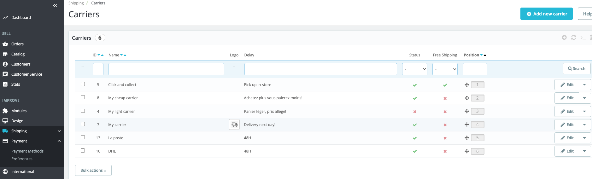

# Carrier list page

&#x20;\
Description

The UI it’s the "Carriers" page. It presents you with a list of all your current carriers. From there, you can directly change their status, indicate why shipping is free or not, and change their position when presented to customers.

<figure><figcaption></figcaption></figure>

## Components description

**Common components**&#x20;

* [Checkmark navigation CTA buttons](../../../../common-components/checkmark-navigation-cta-buttons.md) - [Buttons with icons UI kit](https://build.prestashop-project.org/prestashop-ui-kit/?path=/story/buttons--buttons-with-icons).
* [Help Button](../../../../common-components/help-button.md) - [Buttons Outline UI kit](https://build.prestashop.com/prestashop-ui-kit/?path=/story/buttons--outline).
* [Heading of the page](../../../../common-components/heading-of-the-page.md) - [Headings UI ](https://build.prestashop.com/prestashop-ui-kit/?path=/story/headings--headings)[kit](https://build.prestashop-project.org/prestashop-ui-kit/?path=/story/headings--headings).
* [Breadcrumbs navigation](../../../../common-components/breadcrumbs.md) - [Breadcrumb UI kit](https://build.prestashop.com/prestashop-ui-kit/?path=/story/breadcrumb--breadcrumb).
* [Search input](../../../../common-components/search-input-field.md) - [Forms input with dropdown UI kit](https://build.prestashop-project.org/prestashop-ui-kit/?path=/story/forms--input-with-dropdown).
* [Quick access dropdown](../../../../common-components/quick-access-dropdown.md).
* [PrestaShop version number](../../../../common-components/prestashop-version-number.md).&#x20;
* [Shop switcher with eye icon](../../../../common-components/shop-switcher-with-eye-icon.md).&#x20;
* [Account icon](../../../../common-components/account-icon.md).
* [E-commerce logo](../../../../common-components/e-commerce-logo.md).
* [Setting bar](https://app.gitbook.com/o/-MAz0PPl5s9ulE9xyliu/s/eRh5ljXXvELkmmdiRmg8/\~/changes/366/functional-documentation/ux-ui/common-components/setting-bar)&#x20;
* [Bell icon ](../../../../common-components/bell-icon.md)

## The UI elements

### Filters

### ID

<table><thead><tr><th>Description</th><th>Value</th><th align="center">Error message</th><th data-hidden></th></tr></thead><tbody><tr><td>Mandatory</td><td>No</td><td align="center">-</td><td>Error message if not allowed</td></tr><tr><td>Allowed/Forbidden values</td><td>Allowed letters, numbers, spaces and ().-</td><td align="center">No records founds</td><td></td></tr><tr><td>Default value</td><td>-</td><td align="center">-</td><td></td></tr><tr><td>Help text</td><td>-</td><td align="center">-</td><td></td></tr><tr><td>Tool tips</td><td>-</td><td align="center">-</td><td></td></tr><tr><td>Lower limit</td><td>-</td><td align="center">-</td><td>Error message if bellow the limit</td></tr><tr><td>Upper limit</td><td>-</td><td align="center">-</td><td>Error message if up to the limit</td></tr><tr><td>Behavior</td><td><a href="./#carrier-name-input-behavior">link to the behavior</a></td><td align="center">-</td><td></td></tr></tbody></table>

### Name

<table><thead><tr><th>Description</th><th>Value</th><th align="center">Error message</th><th data-hidden></th></tr></thead><tbody><tr><td>Mandatory</td><td>No</td><td align="center">-</td><td>Error message if not allowed</td></tr><tr><td>Allowed/Forbidden values</td><td>Allowed letters, numbers, spaces and ().-</td><td align="center">No records founds</td><td></td></tr><tr><td>Default value</td><td>-</td><td align="center">-</td><td></td></tr><tr><td>Help text</td><td>-</td><td align="center">-</td><td></td></tr><tr><td>Tool tips</td><td>-</td><td align="center">-</td><td></td></tr><tr><td>Lower limit</td><td>-</td><td align="center">-</td><td>Error message if bellow the limit</td></tr><tr><td>Upper limit</td><td>-</td><td align="center">-</td><td>Error message if up to the limit</td></tr><tr><td>Behavior</td><td><a href="./#carrier-name-input-behavior">link to the behavior</a></td><td align="center">-</td><td></td></tr></tbody></table>

### Delay

<table><thead><tr><th>Description</th><th>Value</th><th align="center">Error message</th><th data-hidden></th></tr></thead><tbody><tr><td>Mandatory</td><td>No</td><td align="center">-</td><td>Error message if not allowed</td></tr><tr><td>Allowed/Forbidden values</td><td>Allowed letters, numbers, spaces and ().-</td><td align="center">No records founds</td><td></td></tr><tr><td>Default value</td><td>-</td><td align="center">-</td><td></td></tr><tr><td>Help text</td><td>-</td><td align="center">-</td><td></td></tr><tr><td>Tool tips</td><td>-</td><td align="center">-</td><td></td></tr><tr><td>Lower limit</td><td>-</td><td align="center">-</td><td>Error message if bellow the limit</td></tr><tr><td>Upper limit</td><td>-</td><td align="center">-</td><td>Error message if up to the limit</td></tr><tr><td>Behavior</td><td><a href="./#carrier-name-input-behavior">link to the behavior</a></td><td align="center">-</td><td></td></tr></tbody></table>

### Status

<table><thead><tr><th>Description</th><th>Value</th><th align="center">Error message</th><th data-hidden></th></tr></thead><tbody><tr><td>Mandatory</td><td>No</td><td align="center">-</td><td>Error message if not allowed</td></tr><tr><td>Allowed/Forbidden values</td><td>-</td><td align="center">-</td><td></td></tr><tr><td>Default value</td><td>-</td><td align="center">-</td><td></td></tr><tr><td>Help text</td><td>-</td><td align="center">-</td><td></td></tr><tr><td>Tool tips</td><td>-</td><td align="center">-</td><td></td></tr><tr><td>Lower limit</td><td>-</td><td align="center">-</td><td>Error message if bellow the limit</td></tr><tr><td>Upper limit</td><td>-</td><td align="center">-</td><td>Error message if up to the limit</td></tr><tr><td>Behavior</td><td><a href="./#carrier-name-input-behavior">link to the behavior</a></td><td align="center">-</td><td></td></tr></tbody></table>

### Free shipping

<table><thead><tr><th>Description</th><th>Value</th><th align="center">Error message</th><th data-hidden></th></tr></thead><tbody><tr><td>Mandatory</td><td>No</td><td align="center">-</td><td>Error message if not allowed</td></tr><tr><td>Allowed/Forbidden values</td><td>Allowed letters, numbers, spaces and ().-</td><td align="center">No records founds</td><td></td></tr><tr><td>Default value</td><td>-</td><td align="center">-</td><td></td></tr><tr><td>Help text</td><td>-</td><td align="center">-</td><td></td></tr><tr><td>Tool tips</td><td>-</td><td align="center">-</td><td></td></tr><tr><td>Lower limit</td><td>-</td><td align="center">-</td><td>Error message if bellow the limit</td></tr><tr><td>Upper limit</td><td>-</td><td align="center">-</td><td>Error message if up to the limit</td></tr><tr><td>Behavior</td><td><a href="./#carrier-name-input-behavior">link to the behavior</a></td><td align="center">-</td><td></td></tr></tbody></table>

### Position&#x20;

<table><thead><tr><th>Description</th><th>Value</th><th align="center">Error message</th><th data-hidden></th></tr></thead><tbody><tr><td>Mandatory</td><td>No</td><td align="center">-</td><td>Error message if not allowed</td></tr><tr><td>Allowed/Forbidden values</td><td>Allowed letters, numbers, spaces and ().-</td><td align="center">No records founds</td><td></td></tr><tr><td>Default value</td><td>-</td><td align="center">-</td><td></td></tr><tr><td>Help text</td><td>-</td><td align="center">-</td><td></td></tr><tr><td>Tool tips</td><td>-</td><td align="center">-</td><td></td></tr><tr><td>Lower limit</td><td>-</td><td align="center">-</td><td>Error message if bellow the limit</td></tr><tr><td>Upper limit</td><td>-</td><td align="center">-</td><td>Error message if up to the limit</td></tr><tr><td>Behavior</td><td><a href="./#carrier-name-input-behavior">link to the behavior</a></td><td align="center">-</td><td></td></tr></tbody></table>

[Table with filter ](https://build.prestashop-project.org/prestashop-ui-kit/?path=/story/tables--with-filters)

****

****
