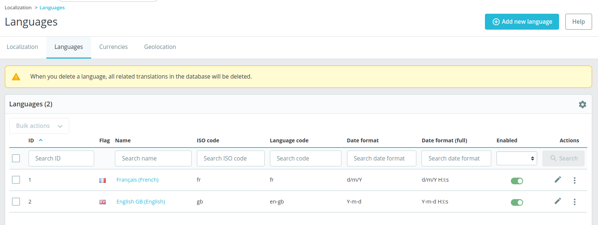

# Languages

## Description

Few messages are displayed in this page:

"Note that this page is available in all shops context only, this is why your context has just switched."

"When you delete a language, all related translations in the database will be deleted."

<figure><figcaption></figcaption></figure>

## Components description

&#x20; \- [Settings Wheel](../../../../common-components/grid-component/settings-wheel.md)&#x20;

### Languages data columns

Any row of a language can be pressed on, then redirects&#x20;

1. ID : Displays the ID number
2. Flag : Displays a picture of a flag that represents the language.&#x20;
3. Name: Name of the language, all the languages names are links, when pressed redirects to the \[edit language] specs.
4. ISO code: ISO code for the country
5. Language code
6. Date format: Date format for the country
7. Date format (full) : Same format as before just with hours as well.
8. Enabled: Toggle switch if the language is enabled or not

On Sorting columns see the [sorting rules](https://app.gitbook.com/o/-MAz0PPl5s9ulE9xyliu/s/eRh5ljXXvELkmmdiRmg8/\~/changes/LBfyCScRUjOVa2zoG5Ub/functional-documentation/ux-ui/common-components/sorting-rule)&#x20;

### Filter columns

#### ID search text area

| Description              | Value                                                       | Error message |
| ------------------------ | ----------------------------------------------------------- | ------------- |
| Mandatory                | -                                                           | -             |
| Allowed/Forbidden values | All letters, numbers, symbols are allowed                   | -             |
| Default value            | Empty field                                                 | -             |
| Behavior                 | [Behavior](languages.md#search-cta) of the search text area | -             |

#### Name search text area

| Description              | Value                                                       | Error message |
| ------------------------ | ----------------------------------------------------------- | ------------- |
| Mandatory                | -                                                           | -             |
| Allowed/Forbidden values | All letters, numbers, symbols are allowed                   | -             |
| Default value            | Empty field                                                 | -             |
| Behavior                 | [Behavior](languages.md#search-cta) of the search text area | -             |

#### ISO code

| Description              | Value                                                       | Error message |
| ------------------------ | ----------------------------------------------------------- | ------------- |
| Mandatory                | -                                                           | -             |
| Allowed/Forbidden values | All letters, numbers, symbols are allowed                   | -             |
| Default value            | Empty field                                                 | -             |
| Behavior                 | [Behavior](languages.md#search-cta) of the search text area | -             |

#### Language code text area

| Description              | Value                                                       | Error message |
| ------------------------ | ----------------------------------------------------------- | ------------- |
| Mandatory                | -                                                           | -             |
| Allowed/Forbidden values | All letters, numbers, symbols are allowed                   | -             |
| Default value            | Empty field                                                 | -             |
| Behavior                 | [Behavior](languages.md#search-cta) of the search text area | -             |

#### Date format and Date format (full) text area

| Description              | Value                                                       | Error message |
| ------------------------ | ----------------------------------------------------------- | ------------- |
| Mandatory                | -                                                           | -             |
| Allowed/Forbidden values | All letters, numbers, symbols are allowed                   | -             |
| Default value            | Empty field                                                 | -             |
| Behavior                 | [Behavior](languages.md#search-cta) of the search text area | -             |

#### Enabled&#x20;

| Description              | Value                                                       | Error message |
| ------------------------ | ----------------------------------------------------------- | ------------- |
| Mandatory                | Yes                                                         | -             |
| Allowed/Forbidden values | Possible options: "All", "Yes", "No".                       | -             |
| Default value            | "All"                                                       | -             |
| Behavior                 | [Behavior](languages.md#search-cta) of the search text area | -             |

## Behaviors description

### **Edit CTA**&#x20;

&#x20;The language can be edited as often as necessary.

See the edit language specs.

**Delete CTA**&#x20;

The language can be deleted by clicking on this button.&#x20;

After clicking on "Delete", a modal with the title "Delete selection" is opened asking to confirm or cancel the action: "Are you sure you want to delete the selected item(s)?" The action can be canceled by clicking on the cross or on the cancel button.&#x20;

After clicking on "Delete" button, the language is deleted, a successful message is displayed "Successful deletion."

### Search CTA

After a field for search was input, the "search" button becomes available to press, and lists the searced results, if there are no matching search results, a message is shown: "No records found".

#### Reset CTA

A reset button appears below the "search" button, when a search is done, when pressed it removes all the searches, and disappears again until the next search is done.

### Bulk actions

* Select all/Unselect all: this button will select/unselect all the checkboxes at the beginning of each row of the listing.
* Delete selected: This button will delete the selected languages. After clicking on "Delete selected", a modal with the title "Delete selection" is opened asking to confirm or cancel the action: "Are you sure you want to delete the selected item(s)?" (See issue [#14462](https://github.com/PrestaShop/PrestaShop/issues/14462)). The action can be canceled by clicking on the cross or on the cancel button. After clicking on "Delete" button, the selected language is deleted, a successful message is displayed "The selection has been successfully deleted."
