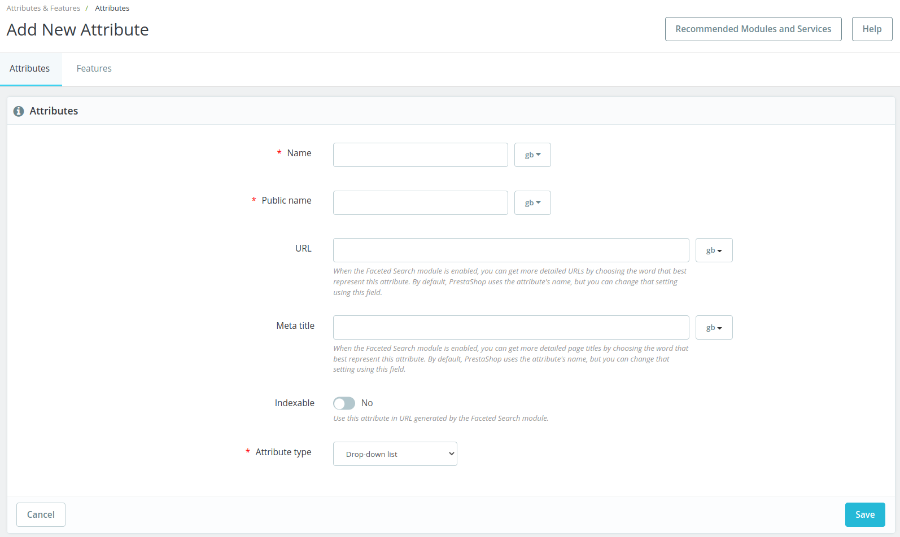

# Edit / Add attribute page

## Description

This page allow to edit or add a product attribute

[QA test](https://build.prestashop.com/test-scenarios/scenarios/core/functional/bo/catalog/attributes-and-features/attributes.html)

## Components description

### Attributes / Features tab

Allow to switch from attributes list to features list. [See call to action](page-template-1.md#attributes-features-tab-call-to-action)

### Name

<table><thead><tr><th>Description</th><th>Value</th><th align="center">Error message</th><th data-hidden></th></tr></thead><tbody><tr><td>Mandatory</td><td>YES</td><td align="center">Tht e field name is required at  least in "<em>default language</em>”</td><td>Error message if not allowed</td></tr><tr><td>Forbidden values</td><td>&#x3C;>;=#{}”</td><td align="center">The name field is invalid.</td><td></td></tr><tr><td>Default value</td><td>-</td><td align="center">-</td><td></td></tr><tr><td>Help text</td><td>Help text</td><td align="center">-</td><td></td></tr><tr><td>Tool tips</td><td>Your internal name for this attribute. Invalid characters &#x3C;>;=#{}” </td><td align="center">-</td><td></td></tr><tr><td>Lower limit</td><td></td><td align="center"></td><td>Error message if bellow the limit</td></tr><tr><td>Upper limit</td><td></td><td align="center"></td><td>Error message if up to the limit</td></tr><tr><td>Behavior</td><td><a href="page-template-1.md#behaviors-description">link to the behavior</a></td><td align="center">-</td><td></td></tr></tbody></table>

### A component description

Several cases

1. The component is a common UI / UX (for example "Help button"): It MUST be a link to this [common components](../../../../../common-components.md)
2. The component is a common component with a standard behavior described in the [UI/KIT](https://build.prestashop.com/prestashop-ui-kit/?path=/story/modals--modal) or Design System : it must be a link to the UI/KIT or DS
3. Otherwise the component MUST be described as a Table as described bellow

<table><thead><tr><th>Description</th><th>Value</th><th align="center">Error message</th><th data-hidden></th></tr></thead><tbody><tr><td>Mandatory</td><td>YES/NO</td><td align="center">-</td><td>Error message if not allowed</td></tr><tr><td>Allowed/Forbidden values</td><td></td><td align="center"></td><td></td></tr><tr><td>Default value</td><td>Default value</td><td align="center">-</td><td></td></tr><tr><td>Help text</td><td>Help text</td><td align="center">-</td><td></td></tr><tr><td>Tool tips</td><td>Tool tips text</td><td align="center">-</td><td></td></tr><tr><td>Lower limit</td><td></td><td align="center"></td><td>Error message if bellow the limit</td></tr><tr><td>Upper limit</td><td></td><td align="center"></td><td>Error message if up to the limit</td></tr><tr><td>Behavior</td><td><a href="page-template-1.md#behaviors-description">link to the behavior</a></td><td align="center">-</td><td></td></tr></tbody></table>

This section COULD contains label (ex: multishop  ...)

## Behaviors description

This section MUST contains :

* A section with the whole picture of the behaviors and worfkow
* For each behavior, a sub section that describes it

### Workflow

This sub-section MUST describe the page workflow

This sub-section MUST include a diagram of this worflow (using : [https://app.diagrams.net/](https://app.diagrams.net) or [figma](https://www.figma.com/file/14ptOoCqDdmBqtmq1Grc5M/BO-Core-Cartography?node-id=0%3A1) ) & the xml export of this workflow

### Behavior description

* This sub-section MUST contains the description of the behavior / call to action.
* This sub-section COULD contains a link to the relevant [business rule](../../../../../../how-to-write-functional-documentation/templates/business-rules-template.md)

This section COULD contains label (ex: multishop case ...)

## Error messages

This section MUST list all errors messages / Exceptions for the page / workflow

## Limitations

This section SHOULD list limitations of the page.
