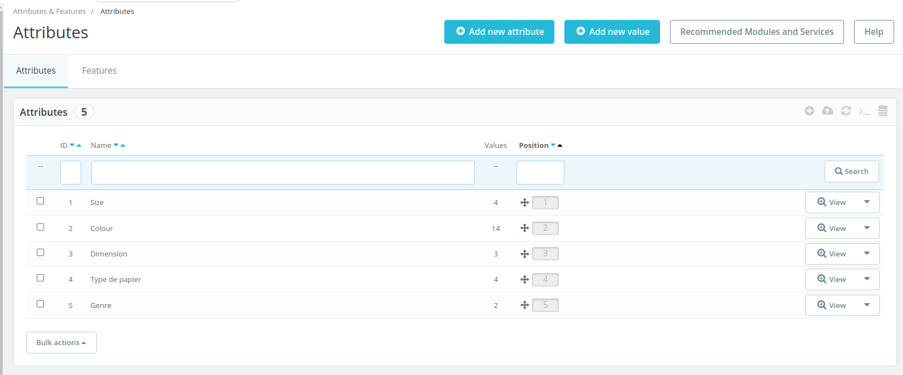

# Attributes List page

## Description

This section MUST describe the page shortly

It MUST include

* [A link to related tests](https://build.prestashop.com/test-scenarios/scenarios/core/functional/bo/catalog/attributes-and-features/attributes.html)

This section COULD include other screenshots of the page depending of the configuration (ex: B2B, Multistore ). Those screenshots MUST be labelled (ex : B2B ) for further uses ( see below)

The screenshot COULD include some labels or numbers to some UI component if needed. So you can refer to this "label" bellow.

## Components description

This section MUST describe each component one by one

### Add new attribute button

To add a new attribute

Call to action : [Add new attribute behavior](page-template.md#add-new-attribute-behavior)

### Add new value button

To add new value

Call to action : [Add new value behavior](page-template.md#add-new-value)

### Help  button

See [Help button](../../../../../common-components/help-button.md) ( common components)&#x20;

### Attributes / Features tab

Allow to switch from attibutes list to features list. [See call to action](page-template.md#attributes-features-tab-behavior)

### Attributes label (number)

Display Attributes (_number of attributes_)&#x20;

### Setting wheels

See[ settings wheel ](../../../../../common-components/settings-wheel.md)(common component)

### Bulk Actions

Clicking on the _Bulk actions_ button allows performing bulk actions for the selected attributes (using the checkboxes). A user can:

* [Select all](page-template.md#bulk-action-select-all)&#x20;
* [Unselect all](page-template.md#bulk-action-unselect-all)
* [Delete selected](page-template.md#bulk-action-select-all-1)

### Label & ordering columns

| Label    |                          Order by                          |
| -------- | :--------------------------------------------------------: |
| id       |                       index ( int )                        |
| Name     |                        name (chars)                        |
| Value    |                             N/A                            |
| Position | position index. Note : the ascendent ording display ...... |

The column can be sort ascending & descending

### Filters

#### ID

| Allowed characters | all                                                                  |   |
| ------------------ | -------------------------------------------------------------------- | - |
| Default value      |                                                                      |   |
| Help text          |                                                                      |   |
| Tool tips          |                                                                      |   |
| Lower limit        |                                                                      |   |
| Upper limit        |                                                                      |   |
| Behavior           | [link to the behavior](page-template.md#one-component-description-1) |   |

#### Name

| Allowed characters | all                                                                  |   |
| ------------------ | -------------------------------------------------------------------- | - |
| Default value      |                                                                      |   |
| Help text          |                                                                      |   |
| Tool tips          |                                                                      |   |
| Lower limit        |                                                                      |   |
| Upper limit        |                                                                      |   |
| Behavior           | [link to the behavior](page-template.md#one-component-description-1) |   |

#### Name

| Allowed characters | all                                                                  |   |
| ------------------ | -------------------------------------------------------------------- | - |
| Default value      |                                                                      |   |
| Help text          |                                                                      |   |
| Tool tips          |                                                                      |   |
| Lower limit        |                                                                      |   |
| Upper limit        |                                                                      |   |
| Behavior           | [link to the behavior](page-template.md#one-component-description-1) |   |

##

##

## Behaviors description

This section MUST contains :

* A section with the whole picture of the behaviors and worfkow
* For each behavior, a sub section that describes it

### Workflow

This sub-section MUST describe the page workflow

This sub-section MUST include a diagram of this worflow (using : [https://app.diagrams.net/](https://app.diagrams.net) ) & the xml export of this workflow

### Add new attribute behavior

Call to action : [Edit / Add attribute page](edit-add-attribute-page.md)

### Add new value behavior

Call to action : [Edit / Add value page](edit-add-new-value.md)

### Attributes / Features tab behavior

call to action Attributes : [reload this page](page-template.md) . It unselects the list

call to action Features : [Features list page](../features/features-list-page.md) &#x20;

### Bulk action select all

Select all attributes into the list

### Bulk action unselect all

Unselect all attributes into the list

### Bulk action Delete selected

This action will delete the selected attributes.&#x20;

After clicking on “Delete selected”, a modal with the title “Delete selection” is opened asking to confirm or cancel the action: “Are you sure you want to delete the selected item(s)?” (See issue [#14462](https://github.com/PrestaShop/PrestaShop/issues/14462)). The action can be canceled by clicking on the cross or on the cancel button. After clicking on “Delete” button, the selected attributes and all their values are deleted, a successful message is displayed “The selection has been successfully deleted.”

See Business rules : delete attributes\

* This sub-section COULD contains a link to the relevant [business rule](../../../../../../../functionnal-documentation/how-to-write-functional-documentation/templates/broken-reference/)

This section COULD contains label (ex: multishop case ...)

## Error messages

This section MUST list all errors messages / Exceptions for the page / workflow

## Limitations

This section SHOULD list limitations of the page.
