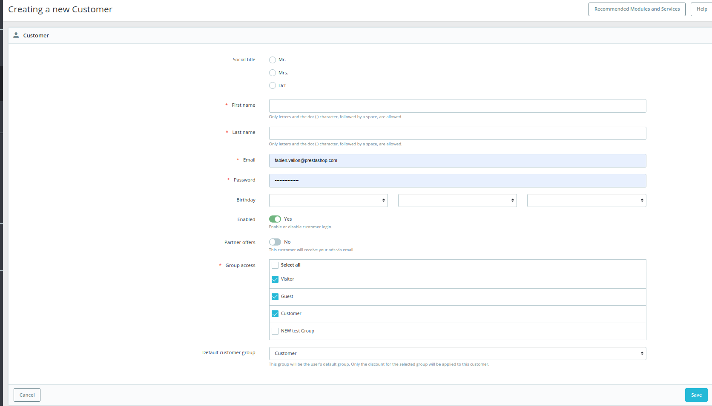

# Creating a new customer

## Description

This page contains the form to create a new customer in the BO.

<figure><figcaption>
creating new customer
</figcaption></figure>

### QA&#x20;

[Link to the test](https://build.prestashop-project.org/test-scenarios/scenarios/core/functional/bo/customers.html)

## Components description

### Common components

* [heading-of-the-page.md](../../../../common-components/heading-of-the-page.md "mention")
* [help-button.md](../../../../common-components/help-button.md "mention")

### Components

* A [form](https://build.prestashop-project.org/prestashop-ui-kit/?path=/story/forms--normal) composed of different types of fields :&#x20;
  * 1 radio button set of 2 buttons
  * 4 text input fields
  * 1 date picker split into 3 dropdown selectors
  * 2 toggles
  * 1 checkbox table with multiple entries
  * 1 dropdown selector linked to the checkbox table
  * 2 buttons

The 4 text fields are as follow :

* First name and last name fields

<table><thead><tr><th width="200">Description</th><th>Value</th><th align="center">Error message</th><th data-hidden></th></tr></thead><tbody><tr><td>Mandatory</td><td>Yes</td><td align="center">-</td><td>Error message if not allowed</td></tr><tr><td>Allowed/Forbidden values</td><td>Only letters and the dot (.) character, followed by a space, are allowed.</td><td align="center">The "[name of the field]" field is invalid.</td><td></td></tr><tr><td>Default value</td><td>Default value</td><td align="center">-</td><td></td></tr><tr><td>Help text</td><td>Only letters and the dot (.) character, followed by a space, are allowed.</td><td align="center">-</td><td></td></tr><tr><td>Tool tips</td><td>-</td><td align="center">-</td><td></td></tr><tr><td>Lower limit</td><td></td><td align="center"></td><td>Error message if bellow the limit</td></tr><tr><td>Upper limit</td><td></td><td align="center"></td><td>Error message if up to the limit</td></tr><tr><td>Behavior</td><td><a data-mention href="../../../../../business-rules/customers/add-a-customer.md">add-a-customer.md</a></td><td align="center">-</td><td></td></tr></tbody></table>

* Email address (Text input)

<table><thead><tr><th width="200">Description</th><th>Value</th><th align="center">Error message</th><th data-hidden></th></tr></thead><tbody><tr><td>Mandatory</td><td>Yes</td><td align="center">-</td><td>Error message if not allowed</td></tr><tr><td>Allowed/Forbidden values</td><td>Must follow the classic email structure</td><td align="center">-</td><td></td></tr><tr><td>Default value</td><td>Default value</td><td align="center">-</td><td></td></tr><tr><td>Help text</td><td>-</td><td align="center">-</td><td></td></tr><tr><td>Tool tips</td><td>-</td><td align="center">-</td><td></td></tr><tr><td>Lower limit</td><td></td><td align="center"></td><td>Error message if bellow the limit</td></tr><tr><td>Upper limit</td><td></td><td align="center"></td><td>Error message if up to the limit</td></tr><tr><td>Behavior</td><td><a data-mention href="../../../../../business-rules/customers/add-a-customer.md">add-a-customer.md</a></td><td align="center">-</td><td></td></tr></tbody></table>

* Password (Text input)

<table><thead><tr><th width="200">Description</th><th width="383">Value</th><th align="center">Error message</th><th data-hidden></th></tr></thead><tbody><tr><td>Mandatory</td><td>Yes</td><td align="center">-</td><td>Error message if not allowed</td></tr><tr><td>Allowed/Forbidden values</td><td>All characters allowed</td><td align="center"></td><td></td></tr><tr><td>Default value</td><td>Default value</td><td align="center">-</td><td></td></tr><tr><td>Help text</td><td>-</td><td align="center">-</td><td></td></tr><tr><td>Tool tips</td><td>-</td><td align="center">-</td><td></td></tr><tr><td>Lower limit</td><td></td><td align="center"></td><td>Error message if bellow the limit</td></tr><tr><td>Upper limit</td><td></td><td align="center"></td><td>Error message if up to the limit</td></tr><tr><td>Behavior</td><td>
When the user starts inputting a password : 
<ul><li>
A security score bar appears under the field along 2 recommendations : 
<ul><li>The password length (between 8 and 72 characters) &#x26; the password strength (Strong)</li></ul></li><li>The security score and bar vary from "very weak" to "very strong" depending on the inputted password</li></ul></td><td align="center">-</td><td></td></tr></tbody></table>

## Behaviors description

### Workflow

The **Creating a new customer** page purpose is to create a new customer using the BR [add-a-customer.md](../../../../../business-rules/customers/add-a-customer.md "mention"). As a result this page only has 1 workflow

The employee creates a new customer by filling at least the mandatory fields :&#x20;

* First name (Text input)
* Last name (Text input)
* Email address (Text input)
* Password (Text input)
* Group access (checkbox)

Then validates their creation by hitting the save button. The employee is then redirected to [.](./ "mention") which displays a success message in a green alert.

TODO : workflow diagram

### Behavior description

* Each mandatory field has its own set of validation rules. These rules are checked upon clicking the save button.

## Error messages

* If one of the mandatory text input fields is empty upon clicking the save button a pop-up asking the user to fill the field appears and refocus the user's screen on the empty field&#x20;
* If the user starts inputting a birthdate, the birthdate needs to be complete with a year, a month and a day otherwise it will be considered invalid.
* The user must have at least 1 item checked in the group access checkbox table otherwise when clicking the save button a red alert message is displayed with the text : \
  "A default customer group must be selected in group box."

##
