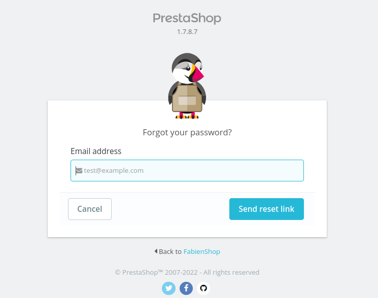

# Prestashop Authentication Window

## Description

This page allows any authorized user to connect to the PrestaShop back-office.

<figure><figcaption>
Prestashop Authentication Window User Interface
</figcaption></figure>

<figure><figcaption>
Flipped send reset link
</figcaption></figure>

## Components description

### Top UI Section

* The top section represents the Prestashop main title name and the Prestashop version, that the administrator is accessing.
* Prestashop version .

### Middle UI Section

* **Logo** - PrestaShop's logo.
* **Shop name** - the shop name, that was defined during the installation process of Prestashop application.
* **Email address** - email input - Email from a SuperAdmin or Employees acount must be used to log-in.
* **Password input** - Password of the email account above from a SuperAdmin or Employees must be used to log-in.
* **Login button** - [Allows access to the back office after verifying that the user is authorized to log-in.](prestashop-authentication-window.md#login-cta)
* **Stay logged in checkbox** - The browser will remember the logging-in status, and the administrator will not be required to input email and password in the next attempt of logging-in. The administrator will be authenticated and redirected to the dashboard instantly .
* **I forgot my password** - specific link, in case administrator forgets the PrestaShop authentication password. Once clicked, the UI instantly flips to the new UI which contains the email input.

If the email, that is being typed in the main login form, is incorrect, the UI will be prompted with the instant error message _Please enter a valid email address._

If the email or password, that is being typed in the main login form, is incorrect, the UI will be prompted with the error message _There is one error. The employee does not exist, or the password provided is incorrect._

If the password, that is being typed in the main login form, is incorrect, the UI will be prompted with the error message _There is one error. Invalid password._

### Flipped send reset link form UI Section

* **Logo** - PrestaShop's logo.
* **Prestashp version** - numeric value of the Prestashop version.
* **Forgot your password?** - question title.
* **Email address** - title of the input, for password resetting.
* **Cancel** - back-flips the UI to the main administration UI form.
* **Send reset link** - [Call-to-action](prestashop-authentication-window.md#send-reset-link-cta) button that initiates the password resetting.

### Input

<table><thead><tr><th>Description</th><th>Value</th><th align="center">Error message</th><th data-hidden></th></tr></thead><tbody><tr><td>Mandatory</td><td>YES</td><td align="center">This field is required.</td><td>Error message if not allowed</td></tr><tr><td>Allowed/Forbidden values</td><td>Only letters, numbers and @</td><td align="center">Please enter a valid email address.</td><td></td></tr><tr><td>Default value</td><td>Empty field</td><td align="center">-</td><td></td></tr><tr><td>Help text</td><td>-</td><td align="center">-</td><td></td></tr><tr><td>Tool tips</td><td>-</td><td align="center">-</td><td></td></tr><tr><td>Lower limit</td><td>0</td><td align="center">-</td><td>Error message if bellow the limit</td></tr><tr><td>Upper limit</td><td>Unlimited</td><td align="center">This account does not exist.</td><td>Error message if up to the limit</td></tr><tr><td>Behavior</td><td><a href="prestashop-authentication-window.md#input-field-in-flipped-ui-behavior">link to the behavior</a></td><td align="center">-</td><td></td></tr></tbody></table>

### Bottom UI Section

The Bottom UI elements remain the same for main login form and flipped send reset link form:

* **Back to Front-Office** - the link, navigating to the Prestashop Front-Office parent home page.
* **Copyright** - Prestashop all rights declaration text.
* **Social networking** - official social networks of Prestashop: Twitter, Facebook, Github and their links.

## Behaviors description

### Send reset link CTA behavior

After typing the email into the input, clicking the button _Send reset link_, a link will be generated and sent to the defined email. The email message will contain unique URL. Clicking that unique URL from email, will redirect to **Reset your password** form. The form will contain **New password** and **Confirm new password** inputs, and those fields are mandatory to fill. After filling new password and retyping new password again in required fields, _Reset password_ button should be clicked. _Cancel_ button will back-flip the UI into the main login screen.

If the email reset attempt is successful, the message will appear _Please, check your mailbox. A link to reset your password has been sent to you._

### Input field in Flipped UI behavior

The place where the email is typed in. There is a placeholder defined in the input - email icon and example email variable [_test@example.com_](mailto:test@example.com). The component is from [Forms Normal UI Kit](https://build.prestashop-project.org/prestashop-ui-kit/?path=/story/forms--normal).

### Login CTA

After successful login to the webshop, the user will be redirected to the Dashboard page, by default. The main page redirection can be set separately in administration options.&#x20;

### Error messages

If users' email link clicking attempt is successful, there will be a redirection back to the Prestashop administration UI with the success message _Your password has been successfully changed. You will be redirected to the login page in a few seconds._ Then administrator will be able to log in using the new password, in the main login form.

If the email that is typed, doesn't exist, there will be an error notification message _There is one error. This account does not exist._

If there is no email input text submitted, the Email address title becomes in red color, red notification message appears below the email input _This field is required._ and the input becomes with red background.

